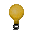

# pixel sketch
Etch-A-Sketch project from the Odin Project's foundations course.

## Description
A browser-based drawing program that allows users to create pixel art, this project
was deisigned to practice my DOM manipulation skills and JavaScript and CSS fundamentals.

## Features
The initial goals for the project were just to create a 16x16 grid and have it so that when the mouse hovers over the grid divs they change color. Another feature would be to allow user input for the number of squares per side of the grid, without changing the total grid size. And finally to add a feature so that with each pass, the squares changes to a random color and a shading feature so that each pass darkens the color by 10%.

## Extra Features
 - Color picker
 
 - Eraser
 
 - Blur
 
 - Change grid shape
 

 
 - Light/Dark Shading
 
 - Toggle Backlight
 
